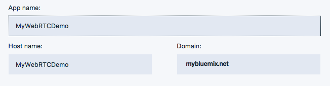
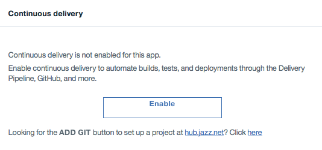
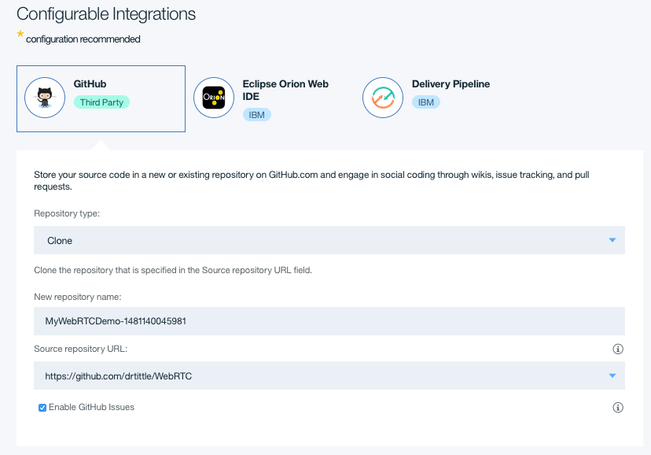
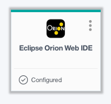
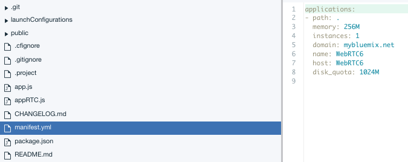
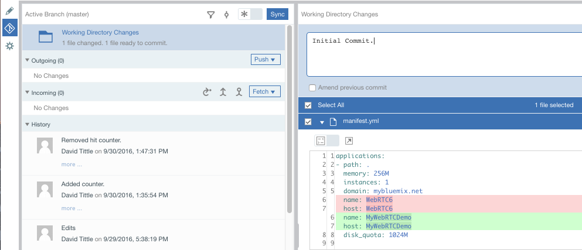

# WebRTC6 Node.js Starter Overview
# Real Time Communcation over Bluemix

The WebRTC Node.js Starter demonstrates a simple, reusable Node.js web application based on the Express framework that is implementing
webRTC patterns for Audio+Video+Data sharing using MultiRTC.

This application highlights many technologies and also shows how to easily extend a Node.js by accessing other packages and having NPM (Node Package Manager) manage the application so it's available to the application.

## Instructions for using the WebRTC application.

The basic function of this presentation is to create a 'room', or a 'mission', where one host can provide a name, open a session, share the link and many users can join and share Audio, Video and Data Streams.

It is important for each user to 'ALLOW' the application access to thier microphone and/or camera.  The application will reasonably adapt if one, or both, are disallowed, but it will give a much better experience to do both.

## To use it:
1. Have a host open a 'room' or a mission.  This name must be unique or the application will simply join you to an already in-use room.
2. The host copies the rooms 'Unique ID' and shares it will others.  This can easily be done automatically by various methods of creating/sharing rooms.
3. Each user should open the link in a up-to-date browser and allow it to use the microphone and camera.  Unfortunately, Internet Explorer seems to hobble somewhat using this applicatin as it doesn't fully support some of the WebRTC functions.
4. Talk, share, chat and have fun! 

## Prequisites
1. A Bluemix account
2. Access to Githup

## Create using your Bluemix Dashboard
1. [Create a Node.js Runtime](https://console.ng.bluemix.net/catalog/starters/sdk-for-nodejs/?taxonomyNavigation=apps)   
      
2. Enter a unique Application Name and Host Name   
         
3. Enable Continuous Delivery   
         
4. Configure GitHub Repository
   
   and overwrite the default Source Repository URL setting with the following [GitHub Link]: https://github.com/drtittle/WebRTC     
5. Click 'Create'   
6. Open the Eclipse Web IDE   
         
7. Edit the Manifest.yml file changing the 'name;' and 'host:' entries to match the values you entered in Step #2 above.
      
   and 'Save' the file.      
8. Goto the Github tab   
      
   and enter a comment, select 'Commit' and then 'Sync'.   
   
Now, this should cause the pre-provided 'Build' and 'Deploy' stages of the Delivery Pipeline to start, which will cause the new code from the cloned GitHub repository to overwite the original Node.js applcation.

You're ready to share video, audio and chat over Bluemix!

## Run the app locally

1. [Install Node.js][]
2. Download and extract the starter code from the Bluemix UI
3. cd into the app directory
4. Run `npm install` to install the app's dependencies
5. Run `npm start` to start the app
6. Access the running app in a browser at http://localhost:6001

[Install Node.js]: https://nodejs.org/en/download/
